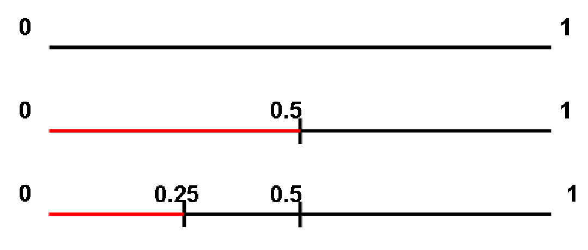
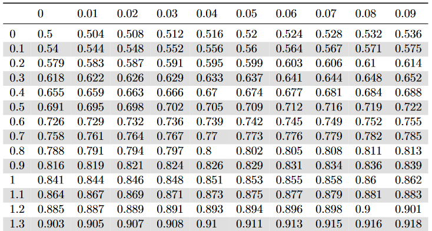

```{r setup, include=FALSE}
knitr::opts_chunk$set(echo = FALSE, cache = TRUE)
knitr::opts_knit$set(eval.after = "fig.cap")
```

```{r load_packages, include=FALSE, cache=FALSE, message=FALSE, warning=FALSE, include=FALSE}
library(tidyverse)
```

```{r ggplot_theme, cache = FALSE, include=FALSE}
theme_set(theme_classic() + theme(strip.text = element_text(size = 16), axis.text = element_text(size = 12), axis.title = element_text(size = 14)))
```

```{r load_refs, echo=FALSE, cache=FALSE, message=FALSE, warning=FALSE, include=FALSE, eval = FALSE}
BibOptions(check.entries = FALSE, 
           bib.style = "authoryear", 
           cite.style = 'alphabetic',
           style = "markdown",
           hyperlink = FALSE, 
           dashed = FALSE)
bib <- ReadBib("bib/PLNreferences.bib", check = FALSE)
citet <- purrr::partial(Citet, bib = bib)
citep <- purrr::partial(Citep, bib = bib)
cite <- purrr::partial(Cite, bib = bib)
```


# About this course...

.blue[Topics]

- Basics in statistics

- Bivariate Analysis

- Sampling

- Estimation

- Confidence Intervals

- Tests

- Simple Linear Regression (hopefully)

---
# About this course...

From **biology** to **biology...** through maths !  

.blue[Modeling]

Move from a biological question to a statistical model accounting for  
- the nature of the data at hand,  
- the randomness of the experiment,    
- error measurement (see last sessions).    

--

.blue[Statistical inference]

Get some information about some of the (unknown) **parameters** appearing in the model. One aims at  
- estimating the parameter,  
- give a (restricted) range of possible values for the parameter,  
- decide whether the parameter belongs to a given interval or not.

---
# Overview of the first session(s)

**Describing a population**  

$\star$ How are individuals distributed w.r.t. height ? To age ?  

$\star$ How are individuals distributed between male and female ?  

--

**Study the relationship between descriptors**  

$\star$ How are height and age related ?   

$\star$ Is the height distribution the same for male and female ?  


---
class: middle, inverse, center

# Finite Population

---
# Definitions

.blue[Population:] a collection of elements of interest  

- the collection of individuals of the French population,  
- the collection of all devices produced in a given factory,  
- the collection of all courses that are proposed in a given university.  

The elements are called **individuals**.  

--

.blue[Variables:] a collection of measurements that describe each individual  
- height, gender and number of children (French people),  
- weight and length (device),  
- number of hours and level (course).  

A measurement made on an individual results in an **observation**.  

---
# Definitions

.blue[Quantitative variables:] the variable is a **quantitative** measurement  
- numeric/continuous: the range of the variable is continuous (height),  
- discrete: only some numeric values are possible (number of child.).  

--

.blue[Qualitative variables:] the variable gives information about class membership  
- nominal: gender, ethnicity,  
- ordinal: class of disease severity.  

---
# Example

.pull-left[
```{r}
G <- as.character(c('M','F','M','M','F','F','M','M'))
H <- c(1.86,1.72,1.75,1.90,1.65,1.68,1.70,1.82)
C <- c(1,0,3,2,1,0,4,2)
FirstEx <- tibble(G=G,H=H,C=C) 
FirstEx
```
]

.pull-right[
- Size of population : $n=8$  
- 3 variables: 
  - gender $G$ (1=Male, 2=Female),    
  - height $H$,  
  - number of children $C$
- Individual 7
```{r}
FirstEx %>% slice(7) %>% as.data.frame()
```
]

--

Variable $H$ measured on individual $i$ results in **measurement** $h_i$

---
# Probabilities on finite pop.

Consider a **population** of $n$ individuals.  

Let $A$ and $B$ be some subsets of individuals, with respective size $n_A$ and $n_B$.  

.def[Definition 1] The probability for an individual drawn at random to belong to subset $A$, also called probability of $A$, is defined as follows:

$$
P(A) = \frac{\text{total number of favorable cases}}{\text{total number of possible cases}} = \frac{n_A}{n} \ \ .
$$


---
# Union, intersection


.def[Definition 2] Denote $A\bigcap B$ the subset of individuals belonging to subsets $A$ and $B$ at the same time. Assume there are $n_{AB}$ such items, one has:
$$P\left(A\bigcap B\right) = \frac{n_{AB}}{n} \ \ .$$  

.def[Definition 3] Denote $A\bigcup B$ the subset of individuals belonging to either $A$ or $B$ (or both). One has:
$$P\left(A\bigcup B\right) = P(A) + P(B) - P\left(A\bigcap B\right) \ \ .$$

--

.question[Quizz 1]

---
# Conditional probability

.def[Definition 4] Denote $P(B|A)$ the conditional probability of $B$ knowing $A$. One has :
$$P(B|A) =  \frac{n_{AB}}{n_A} =  \frac{n_{AB}}{n}\times\frac{n}{n_A} =  \frac{P(A\bigcap B)}{P(A)} \ \ .$$


.def[Definition 5] Two events $A$ and $B$ are independent if they satisfy the property
$$P(A\bigcap B) = P(A)\times P(B) \ \ .$$

--

.question[Quizz 2]

--

.remark[Remark] If $A$ and $B$ are two independent events, then
$$P(B|A) =  \frac{P(A\bigcap B)}{P(A)} = \frac{P(A)\times P(B)}{P(A)} = P(B) \ \ .$$

---
# Distribution

The **probability distribution** associates each possible value of a variable with its probability, 
  - **synthesis without loss of information**

--

$\star$ Qualitative variable example: Gender

```{r}
table(FirstEx$G) / nrow(FirstEx)
```

--

$\star$ Quantitative variable example: Height

```{r}
table(FirstEx$H) / nrow(FirstEx)
```

---
# Graphical representation

For **qualitative/discrete** variables, pie charts and histograms provide an **exhaustive** representation of the distribution.

.pull-left-70[
```{r, fig.align='center', out.height="520px"}
NbIndPerG <- FirstEx %>%
  group_by(G) %>%
  dplyr::summarize(N = n())
blank_theme <- theme_minimal() +
  theme(axis.title.x = element_blank(),
        axis.title.y = element_blank(),
        panel.border = element_blank(),
        panel.grid=element_blank(),
        axis.ticks = element_blank(),
        plot.title=element_text(size=14)
  )

PieG <- ggplot(NbIndPerG, aes(x="", y=N, fill=G)) +
  geom_bar(width = 1, stat = "identity") +
  coord_polar("y", start=0) +
  blank_theme +
  theme(axis.text.x=element_blank(),
        plot.margin = unit(c(1,1,3,1), "cm"),
        legend.text=element_text(size=20),
        legend.title=element_text(size=20),
        plot.title=element_text(size=15)) +
  geom_text(aes(y = c(6,3), label = N), size=7) +
  ggtitle('Nb ind. per gender')

HistC <- ggplot(FirstEx, aes(x=C)) +
  geom_histogram(bins=5,color="black", fill="white",size=2) +
  theme(axis.text=element_text(size=15),
        axis.title=element_text(size=25),
        plot.margin = unit(c(1,1,3,1), "cm"),
        plot.title=element_text(size=15)) +
  ggtitle('NbChild repartition.')

cowplot::plot_grid(PieG, HistC)
# margin = theme(plot.margin = unit(c(1,1,1,1), "cm"))
# grid.arrange(grobs=list(PieG,HistC), nrow = 1, as.table = FALSE)
```
]

--

.pull-right-30[

- What about **quantitative** variables ?

- More on that later

]

---
# Limitations

.def[Remark] The probability distribution is a **synthetic** representation only when the variable has a finite (and small) number of possible values.

--

$\star$ Good representation for qualitative/discrete variables,

$\star$ Poor representation for continuous variables.

--

One can define extra quantities that lead to higher levels of synthesis at the cost of **a loss of information**.

---
## Expectation (mean value)

Example for variable Height

$$\begin{align}
E(H) & = \frac{1}{8} (1.86 + 1.72+ 1.75+ 1.90+ 1.65+ 1.68+ 1.70+ 1.82)\\
     & = 1.86\times\frac{1}{8} + 1.72\times\frac{1}{8}+ 1.75\times\frac{1}{8}+ 1.90\times\frac{1}{8}+ 1.65\times\frac{1}{8} + \dots \\
     & \quad \dots + 1.68\times\frac{1}{8} + 1.70\times\frac{1}{8}+ 1.82\times\frac{1}{8}\\
     &= 1.76 
\end{align}$$
and variable Children

$$\begin{align}
E(C) &= \frac{1}{8}(1 + 0+ 3+ 2+ 1+ 0+ 4+ 2)\\
     &= 0\times\frac{2}{8} + 1\times\frac{2}{8}+ 2\times\frac{2}{8}+ 3\times\frac{1}{8}+ 4\times\frac{1}{8}\\
     &= 1.625     
\end{align}$$

---
## Expectation (Cont'd)

.def[General definition] For a variable $Y$ (case of finite population of size $N$):

$$\begin{equation}
E(Y) = \frac{1}{N} \sum_{i=1}^{N} y_i = \sum_{k=1}^{K} y_k \times P(Y=y_k)
\end{equation}$$

where $K$ is the number of possible values for variable $Y$ in the population.

--

You can compute the mean from:
- the whole population, with $\sum_{i=1}^N y_i / N$
- from the probability distribution, with $\sum_{k=1}^{K} y_k \times P(Y=y_k)$

.center[
Both encode the .alert[same] information
]

---
## Variance

Average squared distance between expectation and observation

$$\begin{align}
V(C) &= \frac{1}{8}\Big\{(1-1.625)^2 + (0-1.625)^2+ (3-1.625)^2+ (2-1.625)^2 \\
     &  \quad +(1-1.625)^2+ (0-1.625)^2+ (4-1.625)^2+ (2-1.625)^2\Big\}\\
     &= \frac{2}{8}(0-1.625)^2+ \frac{2}{8}(1-1.625)^2+ \frac{2}{8}(2-1.625)^2\\
     &  \quad + \frac{1}{8}(3-1.625)^2+ \frac{1}{8}(4-1.625)^2\\
     &= 1.734
\end{align}$$

---
## Variance

.def[General definition] for a variable $Y$ (case of finite population of size N):

$$\begin{equation}
V(Y) = \frac{1}{N}\sum_{i=1}^{N} (y_{i}-E(Y))^2 = \sum_{k=1}^{K} (y_k-E(Y))^2\times P(Y=y_{k})
\end{equation}$$


.def[Standard deviation], expressed in the .alert[same unit] as the measurements.

$$
\sigma(Y) = \sqrt{V(Y)}.
$$

--

You can again compute the variance / standard deviation from:
- the whole population 
- from the probability distribution

.center[
Both encode the .alert[same] information
]

---
.small[
.pull-left[
```{r, fig.align='center'}
data <- tibble(Children = c(1,3,2,2,3,4,1,1,2,3,1,3,0,3,4,4,3,4,0,0,0,4,0,3,0,4,3), 
               Population = rep(c("Pop. 2", "Pop. 3"), times = c(12, 15)))
data %>% select(Population, Children) %>% data.table::as.data.table()
```
]
]

.pull-right[
```{r, fig.align='center'}
ggplot(data, aes(x = Children)) + geom_histogram(binwidth = 1) + facet_wrap(~Population, ncol = 1)
```

.question[Quizz 3]
]


---
## Expectation vs Variance

Number of children per individual in 2 populations:

**Population 2**: $\{1,3,2,2,3,4,1,1,2,3,1,3\}$

**Population 3**: $\{0,3,4,4,3,4,0,0,0,4,0,3,0,4,3\}$

$$\begin{equation}
\begin{array}{c||c|c|c|c|}
        & Size  & Mean  & Variance  & St.Dev \\
\hline
Pop.2   & 12    & 2.16  & 0.97      & 0.98   \\
Pop.3   & 15    & 2.13  & 3.18      & 1.78   \\
\hline
\end{array}
\end{equation}$$

Variance/std deviation measures how .alert[spread out] the population is.

--

- Here Population 2 is **more homogeneous** than Population 3.

--

.blue[Expectation versus variance]

- Expectation gives the **location** of the population
- Variance quantifies the **dispersion** from the expectation.

---
# Median

The median $y_{0.5}$ for distribution of variable $Y$ is the smallest value such that at least $50\%$ of the population has a value of $Y$ lower or equal to $y_{0.5}$.

.pull-left[
```{r, fig.height=5, fig.width=7}
data <- tibble(Children = c(1, 0, 3, 2, 1, 0, 4, 2))
ggplot(data, aes(x = Children)) + geom_histogram(binwidth = 1, color = "black") + geom_vline(xintercept = 1.5, size = 2, color = "red")
```
]

.pull-right[
.blue[Example of computation] Number of Children in Population 1

- Collect data $\{1, 0, 3, 2, 1, 0, 4, 2\}$
- Reorder data from lowest to highest $\{0, 0, 1, 1, 2, 2, 3, 4\}$
- Value 1 splits the population into 2 groups of equal size
]

--

.center[
The .blue[median] splits the population into two parts of (roughly) .alert[equal size].
]

---
### Understanding medians

.pull-left[
Compute the median of:
- P1: $\{0, 0, 1, 1, 2, 2, 3, 4\}$ 

- P2: $\{0, 0, 1, 1, 1, 2, 2, 3, 4\}$

- P3: $\{0, 0, 1, 1, 1, 2, 2, 3, 4, 5, 6\}$

.question[Quizz 4]
]

--

.pull-right[
.small[
```{r, echo = TRUE}
c(0, 0, 1, 1, 2, 2, 3, 4) |> median()
c(0, 0, 1, 1, 1, 2, 2, 3, 4) |> median()
c(0, 0, 1, 1, 1, 2, 2, 3, 4, 5, 6) |> median()
```
]
]

--

.center[
.alert[Beware], computers try to find the midpoint instead. 
]

---
### Understanding medians (II)

.question[Quizz 5]

.pull-left[
```{r, fig.height=5}
set.seed(53)
data <- tibble(x = round(rexp(2000, rate = 0.2)))
ggplot(data, aes(x)) + geom_histogram(binwidth = 2)
```
]

--

.pull-right[
```{r, fig.height=5}
ggplot(data, aes(x)) + geom_histogram(binwidth = 2) + 
  geom_vline(xintercept = mean(data$x), color = "red") + 
  geom_vline(xintercept = median(data$x), color = "green") + 
  annotate("text", x = mean(data$x), y = 400, label = "mean", hjust = 0, color = "red", size = 7, fontface = "bold") + 
  annotate("text", x = median(data$x), y = 400, label = "med.", hjust = 1, color = "green", size = 7, fontface = "bold") + 
  NULL
```
]

---
# Quantiles

The .blue[quantile] $y_{\alpha}$ for distribution of variable $Y$ is the smallest value such that at least $\alpha\times100\%$ of the population has a value of $Y$ lower or equal to $y_{\alpha}$. In particular

$$\begin{equation}
P(Y \leq y_\alpha) \geq \alpha \quad \text{and} \quad P(Y < y_\alpha) \leq \alpha
\end{equation}$$

--

The quantile $y_{\alpha}$  splits the population into two parts of sizes (roughly equal to) $\alpha\times100\%$ and $(1-\alpha)\times100\%$.

---
# Expectation versus Median

Number of children per individual in 2 populations:
- Population 2: $\{1,3,2,2,3,4,1,1,2,3,1,3\}$
- Population 3: $\{0,3,4,4,3,4,0,0,0,4,0,3,0,4,3\}$
- Population 4: $\{1,3,2,2,3,4,1,1,2,3,1,8\}$

$$\begin{array}{c||c|c|c|c|c|c|c|}
        & \text{Size}  & \text{Mean}  & \text{Variance}      & \text{Std Dev.}  & C_{20\%}   & \text{Median}    & C_{80\%}    \\
\hline
Pop.2   & 12    & 2.16  &     0.97      & 0.98      &              &          &               \\
Pop.3   & 15    & 2.13  &     3.18      & 1.78      &              &          &               \\
Pop.4   & 12    & 2.58  &     3.57      & 1.89      &              &          &               \\
\hline
\end{array}$$

--

.def[Remark 1:] Outliers have less influence on median than on expectation. More generally, quantiles are **robust** to outliers. 

.def[Remark 2:] Usually more than 1 descriptor (mean, variance, median...) is requested to accurately describe a population.

---
### Graphical representation: Continuous variable

Height in Population 1

.pull-left-70[
```{r, out.width="1000px", fig.align='center', fig.width = 10, fig.height= 6}
HistH <- ggplot(FirstEx, aes(x=H)) +
  geom_histogram(bins=5,color="black", fill="white",size=2) +
  theme(axis.text=element_text(size=15),
        axis.title=element_text(size=25),
        plot.margin = unit(c(1,1,3,1), "cm"),
        plot.title=element_text(size=15)) +
  ggtitle('Histogram')

BoxplotH <- ggplot(FirstEx, aes(x='',y=H)) +
  geom_boxplot() +
  geom_jitter(width = 0.2,color='blue',size=3) +
  theme(axis.text=element_text(size=15),
        axis.title=element_text(size=25),
        axis.title.y=element_blank(),
        plot.margin = unit(c(1,1,3,1), "cm"),
        plot.title=element_text(size=15)) +
  xlab('H') +
  ggtitle('Boxplot')
gridExtra::grid.arrange(grobs=list(HistH,BoxplotH) ,nrow = 1, as.table = FALSE)
```
]

.pull-right-30[
- Histogram: values of variable $Y$ in abscisses, counts in ordinates.

- Box-plot: displays $H_{25\%}$, $H_{50\%}$ and $H_{75\%}$, outliers (if any) and the $1.8\times IQR$ range in ordinates
]

--

.center[
And **no general convention for boxplots...**
]

---
## Cumulative distribution function

For a quantitative variable $Y$ with probability distribution $P$, the cdf is noted $F$ and defined as follows:
$$F(y) = P(Y\leq y).$$

```{r,fig.height=4, fig.width=10, fig.align='center'}
TH <- theme(axis.text=element_text(size=12),
      axis.title=element_text(size=15),
      plot.title=element_text(size=15),
      strip.text.x = element_text(size = 20),
      legend.text=element_blank())

MakeDF <- function(VarName,AltName=NULL){
  Var <- sort(get(VarName))
  Values <- unique(Var)
  Range <- range(Values)
  Prob=c(0,(cumsum(table(Var))/length(Var))[-length(Values)])
  Plot.x <- seq(Range[1]-0.05*(Range[2]-Range[1]),Range[2]+0.05*(Range[2]-Range[1]),length.out=1000)
  Plot.y <- rep(1,1000)
  invisible(sapply(length(Values):1, function(val){
    Plot.y[Plot.x <=Values[val]] <<- Prob[val]
  }))
  DF <- data.frame(Values=Plot.x,Prob=Plot.y)
  if (is.null(AltName)){
    TitleVN <- VarName
  } else {
    TitleVN <- AltName
  }
  GG <- ggplot(DF,aes(x=Values,y=Prob)) +
    geom_line(size=2) +
    ggtitle(paste0('CDF for variable ',TitleVN)) +
    TH
  return(GG)
}
gridExtra::grid.arrange(grobs=map(c("C","H"),MakeDF),nrow=1)
```

The definition is $F(y) = P(Y\leq y)$ and **not** $F(y) = P(Y < y)$.

---
## Probability distribution vs CDF

Providing the CDF is equivalent to providing the probability distribution function !

```{r,fig.height=4, fig.align='center'}
Pop3 <- c(0,3,4,4,3,4,0,0,0,4,0,3,0,4,3)
MakeDF("Pop3",'C in Pop.3')

```

Compute the following: 

.pull-left[ 
- $P(C = 4)$ 
- $P(C = 2)$ 
- $P(1 \leq C \leq 3)$
]
--

.pull-right[
- $P(C=4)={0.33 = 5/15}$
- $P(C=2)={0}$
- $P(1\leq C\leq3)={0.26=4/15}$
]

---
class: middle, inverse, center

# A detailed example

---
class: center
# The summer school dataset

```{r, eval = TRUE}
set.seed(42)
n <- 731
Agro <- tibble(Gender = sample(c("F", "M"), size = n, replace = TRUE), 
               Age    = sample(19:23, size = n, prob = 5:1, replace = TRUE), 
               Year   = case_when(
                 Age == 19 ~ "1A", 
                 Age >= 22 ~ "3A",
                 Age == 20 ~ sample(c("1A", "2A"), size = n, replace = TRUE), 
                 Age == 21 ~ sample(c("2A", "3A"), size = n, replace = TRUE), 
               ),
               Height = if_else(Gender == "M", rnorm(n = n, mean = 178, sd = 6), rnorm(n = n, mean = 165, sd = 4)), 
               Weight = runif(n, min = 18, max = 25) * (Height/100)^2 %>% round(2))
Agro <- Agro %>% select(all_of(c('Height','Weight','Age', 'Year', 'Gender')))
head(Agro)
```

---
## Univariate analysis

```{r}
# Get numbers and proportion for qualitative variables
t <- table(Agro$Gender,Agro$Age)
QualiUniDesc <- function(t,m){
  mt <- t %>% margin.table(m)
  pt <- mt %>% prop.table() %>% round(2)
  Res <- rbind(mt,pt)
  row.names(Res) <- c('Nb','Freq')
  print(Res)
}
```

.blue[Qualitative variables:]

$\star$ Gender
```{r}
QualiUniDesc(t,1)
```

$\star$ Age
```{r}
QualiUniDesc(t,2)
```

---
# Univariate analysis


.blue[Quantitative variables:]

```{r,message=FALSE,fig.width = 12, fig.height = 6, fig.align='center'}
QuantiUniDesc <- function(VN){
  Bin <- length(unique(Agro[[VN]]))
  ggplot(Agro, aes(x=get(VN))) +
  geom_histogram(bins=min(30,Bin)) + #color="black", fill="white",size=2
  theme(axis.text=element_text(size=15,angle=45),
        axis.title=element_text(size=20),
        plot.margin = unit(c(0.7,0.5,0.2,0.7), "cm"),
        plot.title=element_text(size=15)) +
  xlab(VN)
}
GraphList <- map(c('Height','Weight','Age'), QuantiUniDesc)
gridExtra::grid.arrange(grobs=GraphList ,nrow = 2, as.table = FALSE)
```

---
## Univariate analysis

.blue[Cumulative distribution function]

```{r,fig.height=6, fig.width=12, fig.align='center'}
Agro.Height <- Agro$Height
Agro.Weight <- Agro$Weight
par(mfrow = c(1, 2))
ecdf(Agro.Height) %>% plot()
ecdf(Agro.Weight) %>% plot()
par(mfrow = c(1, 1))
```

---
class: middle, inverse, center

# Infinite population

---
## Case I: qualitative variable

.blue[Coin tossing]
Each coin tossing is a 0/1 experiment:

$$X = \begin{cases}
1 & \text{if  tail is obtained} \\
0 & \text{otherwise}
\end{cases}$$

How can we describe the population of **all** coin tossing trials ?

--

Let $n_T$ and $n_H$ be the number of tails (resp. heads) after $n$ trials. Then

$$\begin{equation}
P(X = 1) = \underset{n\rightarrow\infty}{\lim}\frac{n_{T}}{n} \text{ and }  P(X = 0) = \underset{n\rightarrow\infty}{\lim}\frac{n_{H}}{n} \ \ .
\end{equation}$$

--

Note that by definition $n_T+n_H=n \Leftrightarrow n_T/n + n_H/n =1$
$$\Rightarrow P(X = 0)+P(X = 1)=1 \ \ .$$

---
## Example 1: Coin tossing

The population of coin tossing trials (or alternatively the result of a coin tossing trial) can be
.blue[modeled] using the .alert[Bernoulli] distribution:

$$X \hookrightarrow \mathcal{B}(p).$$

.blue[Probability distribution]
$$P(X=x) = p^x(1-p)^{1-x} = \begin{cases} p & \text{if } x = 1 \\ 1 - p & \text{if } x = 0 \end{cases}$$

.blue[Expectation and variance] 
--
$$E(X)=p,\quad V(X)=p(1-p)$$

---
## Example 2: Cumulated coin tossing
Now consider the cumulated  result of $K$ coin tossing trials:

$$X \in \{0,...,K\}$$

One can define

$$P(X=x)\ =\ \underset{n\rightarrow \infty}{\lim}\frac{n_x}{n}\ \overset{def}{=}\ p_x,\quad \forall x\in\{0,...,K\}.$$
--

Alternatively,  assuming .blue[independence between trials] and .blue[identical "tail" probabilities], one has

$$P(X=x)={x \choose K} p^x(1-p)^{K-x}$$
which corresponds to the .blue[Binomial probability distribution]:

$$X\hookrightarrow \mathcal{B}(K,p)$$
--
One easily check that
$$\sum_xP(X=x)=1,\quad E(X)=Kp,\quad V(X)=Kp(1-p)$$


---
## Case II: quantitative discrete variable

.blue[Light bulb lifetime]

Denote $X$ the lifetime of a bulb, measured in hours.
How can we describe the population of **all** bulbs ?

--

Let $n_x$ be the number of bulbs that last $x$ hours over $n$ bulbs. Then
$$\begin{equation}
P(X = x) = \underset{n\rightarrow\infty}{\lim}\frac{n_{x}}{n}
\end{equation}$$

--
As for the previous example, one has:
$$
\sum_{x=1}^{\infty} P(X = x) = 1 \ \ .
$$

---
## Example: Light bulb lifetime
```{r, eval = TRUE, message=FALSE}
set.seed(42)
n <- 300
Lambda <- 150
Life <- rpois(n,lambda = Lambda)
NbCases <- Life %>% unique %>% length
Life.range <- min(Life):max(Life)
Coef=2
TH <- theme(axis.text=element_text(size=10*Coef),
      axis.title=element_text(size=15*Coef),
      plot.title=element_text(size=15*Coef),
      strip.text.x = element_text(size = 20*Coef),
      legend.text=element_text(size=12*Coef),
      legend.title = element_text(size=15*Coef))
Life.hist <- Life %>% as.data.frame %>%
  ggplot() + geom_histogram(aes(x=Life,stat(density)),bins=NbCases*0.5,color="black", fill="white",size=2)+TH
ggsave(plot = Life.hist,
       filename = 'Figures/ExemplePoisson.pdf',device = 'pdf')
Tmp <- data.frame(x=Life.range,y=dpois(Life.range,lambda = Lambda))
Life.hist.points <- Life.hist + geom_point(data=Tmp,aes(x=x,y=y),col='red',size=2)
ggsave(plot = Life.hist.points,
       filename = 'Figures/ExemplePoissonAvecProbas.pdf',device = 'pdf')
```

.pull-left[
Assume one observed a sample of bulb lifetimes:

`r Life[1]`, `r Life[2]`, `r Life[3]`, `r Life[4]`, `r Life[5]`,
`r Life[6]`, `r Life[7]`, `r Life[8]`,...

]

.pull-right[
```{r, fig.width=6}
Life.hist.points
```
]

---
## Example: Light bulb lifetime
```{r, message=FALSE}
Coef <- 2
TH <- theme(axis.text=element_text(size=10*Coef),
      axis.title=element_text(size=15*Coef),
      plot.title=element_text(size=15*Coef),
      strip.text.x = element_text(size = 20*Coef),
      legend.text=element_text(size=12*Coef),
      legend.title = element_text(size=15*Coef))
NbHours <- 800
Lambda <- c(100,200,500)
DF <- data.frame(Hours=rep(1:NbHours,3),
                 Lambda=rep(Lambda,times=NbHours)) %>%
  mutate(Prob=dpois(x = Hours,lambda = Lambda), Lambda=as.character(Lambda))
GG <- ggplot(DF,aes(x=Hours,y=Prob,fill=Lambda)) +
  geom_col(size=2) +
  ylab('Prob(X=x)') +
  xlab('x (in hours)') +
  TH
```


The light bulb population distribution can **modeled**
using the Poisson distribution: $L \hookrightarrow \mathcal{P}(\lambda)$

.pull-left-70[
```{r, fig.align='center', fig.height=5, fig.width=8}
GG
```
]

.pull-right-30[
.blue[Probability distribution]

$$P(X=x)= \begin{cases} \frac{e^{-\lambda}\lambda^x}{x!} & \text{if } x \in \mathbb{N} \\ 0 & \text{Otherwise} \end{cases}$$
]

---
## Example II: Light bulb lifetime

Expectation and variance of a random variable with Poisson distribution can be theoretically obtained as follows:


.pull-left[
.blue[Expectation]
$$
E(X) = \lambda
$$
]

.col-right[
.blue[Variance]
$$
V(X) = \lambda
$$
]
--

.pull-left[
$$\begin{align}
E(X) &= \sum_0^{+\infty} x\times P(X=x) \\
&= \sum_1^{+\infty} x\times\frac{e^{-\lambda} \lambda^x}{x!} \\
&= \sum_1^{+\infty}  \frac{e^{-\lambda} \lambda^x}{(x-1)!}\\
&= \lambda \sum_0^{+\infty}  \frac{e^{-\lambda} \lambda^x}{x!} = \lambda
\end{align}$$
]

.col-right[
$$\begin{align}
E[X(X-1)] &= \sum_0^{+\infty} x(x-1)\times P(X=x) \\
&= \sum_2^{+\infty} x(x-1)\times\frac{e^{-\lambda} \lambda^x}{x!} \\
&= \sum_2^{+\infty}  \frac{e^{-\lambda} \lambda^x}{(x-2)!}\\
&= \lambda^2 \sum_0^{+\infty}  \frac{e^{-\lambda} \lambda^x}{x!} = \lambda^2
\end{align}$$
]

---
## Example III: Continuous variable

.blue[Deviance to target]

Denote $X$ the deviance to target observed for a given trial in a shooting contest.
How can we describe the population of **all** deviances ?

--

Deviance is assumed to be measured with **absolute** precision:

$x=3$ means that the deviance is exactly 3.0000000... cm.

--

Let $n_x$ be the number of trials that deviated from target with deviance $x$ in a sample of $n$ trials. One has:
$$
P(X = x) = \underset{n\rightarrow\infty}{\lim}\frac{n_{x}}{n} = 0 \text{    !!!}
$$

.alert[But]

$\star$ Some values seem more likely than others,

$\star$ The probability of a range of values is not 0: $P(x_1<X<x_2)>0$

---
## A short illustration of density
.blue[Mass density function]

$\star$ Consider a **homogeneous** stick of length 1m and weight 0.7kg.

.pull-left[
$$\begin{array}{lll}
\text{Interval (m)} & \text{Density (kg/m)} & \text{Mass (kg)} \\
[0,1]   & 0.7  & 0.7  \\
[0,0.5] & 0.7 &  0.35 \\
[0,0.25] & 0.7 & 0.175  \\
[x,x+dx] & 0.7 & 0.7dx \\
\end{array}$$
]

.pull-right[
.center[]
]

--

$\star$  Consider an **inhomogeneous** stick of length 1m and weight 0.7kg.
One needs to provide at each point $x$ the density $f(x)$, that may differ from an $x$ to another:

$$\begin{array}{lll}
\text{Interval (m)} & \text{Density (kg/m)} & \text{Mass (kg)} \\
[0,1]   & 0.7  & 0.7  \\
[x,x+dx] & f(x) &  f(x)dx \\
\end{array}$$

---
## A more formal definition

.blue[Probability density function]
The density function is defined at point $x$ as

$$
\begin{align}
f(x)dx &= P(x \leq X \leq x+dx) \\
\Rightarrow f(x) &=& \frac{P(x \leq X \leq x+dx)}{dx}.
\end{align}
$$

--

If $X$ takes its values in interval $[a,b]$, then one can "sum" (integrate) probabilities associated with all possible values of $X$ to obtain:

$$
\int_a^b f(x)dx = P(a \leq X \leq b) = 1
$$

--

From this, the expectation and variance for a quantitative continuous variables are defined as:

$$\begin{align}
E(X) &= \int x \times f(x)dx \\
V(X) &= \int (x-E(X))^2 \times f(x)dx
\end{align}$$

--

And in general, for any numeric function $g$ (such as $g(x) = x$ for the mean and $g(x) = (x - E[X])^2$ for the variance)

$$
E\left[ g(X) \right] = \int g(x) \times f(x)dx
$$

The expectations corresponds to 

---
## Back to example III: Deviance to target

The population of deviances in a shot trial can be **modeled** using the Normal distribution:
$$
X \hookrightarrow \mathcal{N}(\mu,\sigma^2),\ \text{ with } \mu=0
$$

.pull-left[
```{r}
knitr::include_graphics("Figures/Normale.png", dpi = 250)
```
]

.pull-right[
.blue[Probability density function]
$$f(x)=\frac{1}{\sqrt{2\pi}\sigma} \exp^{-\frac{(x-\mu)^2}{2\sigma^2}}$$
.blue[Expectation and variance]
$$ E(X)=\mu \ \ \text{ and } \ \ V(X)=\sigma^2 $$
]

---
## Quantiles for continuous variables

The definition of quantile $x_\alpha$ does not change: minimum value such that
$$P(X\leq x_\alpha)\geq \alpha$$

.blue[Interpretation] in terms of integration

Minimum value $x_\alpha$ such that
$$\int_{-\infty}^{x_\alpha}f(x)dx\geq \alpha$$
--

.blue[Remark] Note that both the pdf and the cdf are characteristic to the probability distribution.


---
## Illustration: quantiles for the $\mathcal{N}(0,1)$ distribution

.pull-left[



]

--

.col-right[
Compute 
- $P(X\leq 1.05)$ 
- $P(X\geq -1)$
- $x_{0.75}$
- $x_{0.1}$
- $P(-1\leq X\leq 1)$
]

--

.pull-right[
- $P(X\leq 1.05)={0.853}$
- $P(X\geq -1)={P(X\leq1)=0.841}$
- $x_{0.75}={0.67}$
- $x_{0.1}={-x_{0.9}=-1.28}$
- $P(-1\leq X\leq 1)={P( X\leq 1)-P( X\leq-1)=0.682}$
]

---
## Finite vs infinite population: sampling

.blue[Sampling in a finite population]
Consider a population of 3 individuals: 1 male and 2 female.

$\star$ Probability of sampling 1 male ?

--

$$
P(G_1=m) = 1/3
$$

--

$\star$ Probability of sampling 2 males ? .question[Quizz6]

--

$$
P(G_1=m\cap G_2=m) = P\left(G_2=m | G_1=m\right)P\left(G_1=m\right) = 0
$$

--

.blue[Conclusion]

$\star$ $G_1$ drawn according to the distribution of the population,

$\star$ $G_2$ given $G_1$ **not** drawn according to the distribution of the population. The second draw distribution depends on the first draw: .alert[no independence between samplings]

---
## Finite vs infinite population: sampling

.blue[Sampling in an infinite population]
Consider an infinite population of males and females, with proportions 1/3 and 2/3.

$\star$ Probability of sampling 1 male  ?

--

$$P(G_1=m) = 1/3$$

--

$\star$ Probability to sample 2 males ?

$$P(G_2=m\cap G_1=m) = P\left(G_2=m | G_1=m\right)P\left(G_1=m\right) = (1/3)^2$$

--
.blue[Conclusion]
  
$\star$ $G_1$ drawn according to the distribution of the population,

$\star$ $G_2$ **also** drawn in the distribution of the population.

--

This leads to the so-called **"i.i.d" assumption**: all observations are  **i**ndependent and **i**dentically **d**istributed.

---
## Exercise 1: Tennis

Assume that a tennisman play games that last

- 3 sets in 60% of the games,
- 4 sets in 25% of the games,
- 5 sets in 15% of the games.


- What is the expectation of number of played set for this player ?
- What is the variance of number of played set for this player ?

--

.blue[Answer:] $E(N)=3.55$,  $V(N)=0.547$

---
## Exercise 2: The Pepsi factory

A Pepsi factory machine builds cans of height 115mm, with a standard deviation of 0.4mm. The Pepsi specification requires all cans lower than 114mm or 116mm to be withdrawn.

- Assuming the distribution of the can height is normal, what proportion of cans meets the specification ?
- Assume the machine get disrupted such that produced cans have height 114.5 on average. What proportion of cans meets the specification ?

--

.blue[Answer:] 

- Q1: 0.987
- Q2: 0.894

---
## Exercise 3: properties of expectation and variance

Assume that variable $X$ as expectation $\mu$ and variance $\sigma^2$.
Let $a$ and $b$ be two constants.
Provide the expression of

- $E(aX+b)$
- $V(aX+b)$

--

.blue[Answer:]
- $E(aX+b) = a\mu+b$
- $V(aX+b) = a^2\sigma^2$

Proof in lecture 3.

---
## Exercise 4: Moments

Compute $E(X^2)$ in the following cases:
- $X\sim \mathcal{B}(p)$
- $X\sim \mathcal{N}(\mu,\sigma^2)$
- $X\sim \mathcal{E}(\lambda)\quad\quad$

--

.blue[Answer:] 
- $p$,  
- $\sigma^2+\mu^2$, 
- $\lambda(\lambda+1)$

---

## Exercise 5: Dice

Consider $X$ the value obtained when rolling a fair dice.
Provide the expression of

- $E(X)$
- $E[\|X-E(X)\|]$

--

.blue[Answer:]
- $E(X) = 3.5$
- $E[\|X-E(X)\|]=1.5$


---
## Summary

- In statistics, characterizing a population amounts to providing a .alert[probability distribution] (qualitative/discrete case) or a **probability density function** (continuous case).

--

- Alternatively, one can provide the **cumulative distribution function**.

--

- Some "classical" theoretical distributions allow one to **model** different populations.

--

- These theoretical populations are usually **parametric**, i.e. a few parameters rule the shape of the distribution.

--

- **Expectation** and **variance** can be expressed in terms of the distribution parameters.
