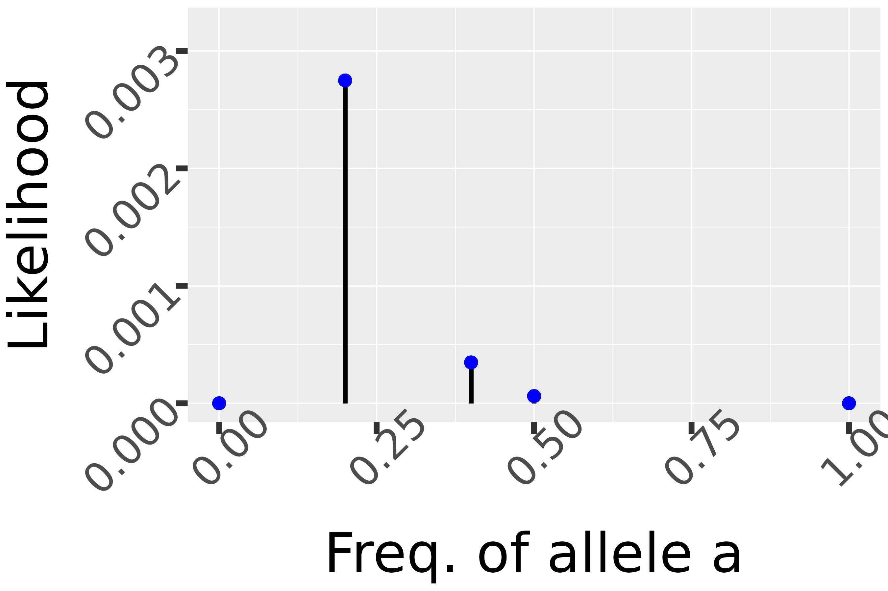

  
```{r setup, include=FALSE,comment=NA}
knitr::opts_chunk$set(echo = FALSE)
library(ggplot2)
library(dplyr)
THFtn <- function(Coef){
  theme(axis.text=element_text(size=10*Coef),
      axis.title=element_text(size=15*Coef),
      plot.title=element_text(size=15*Coef),
      strip.text.x = element_text(size = 20*Coef),
      legend.text=element_text(size=12*Coef),
      legend.title = element_text(size=15*Coef))
} 
```

---
class: middle, inverse, center

# Recap

---
## So far...

Last session we focused on the estimation of the .alert[population mean].  

--

We established the following points:

- Any estimation strategy requires 
  - a way to sample the individuals from the population (eg SRS and iid sampling) 
  - a strategy to compute the estimate from the sample (eg empirical average).

- Different estimation strategies can be evaluated/compared through their bias, variance and MSE.

- SRS / iid seems a relevant strategy for which theoretical guarantees can be derived.

--

.center[
Assuming now that observations are sampled independently from a parametric distribution $\L(\theta)$, can we propose a *systematic* way to obtain a good estimator for parameter $\theta$ ?
]

---
class: middle, inverse, center

# Technical detour: Properties of gaussian variables

---
## Gaussian variable

.def[Definition:] A real-valued continuous random variable $X$ is normally distributed $\mathcal{N}(\mu, \sigma^2)$, noted $X \sim \mathcal{N}(\mu, \sigma^2)$:

$$
f_{\mu, \sigma}(x) = \frac{1}{\sigma\sqrt{2\pi}}e^{-\frac{(x - \mu)^2}{2\sigma^2}}
$$

where $\mu$ is the .blue[mean] and $\sigma$ the .blue[standard deviation].

--

In other words, the probability that $X$ takes values in an infinitesimal interval of size $dx$ around $x$ is
$$
\mathbb{P}\left( X \in \left[x - \frac{dx}{2}, x + \frac{dx}{2} \right] \right) = f_{\mu, \sigma}(x)dx
$$
When moving to non infinitesimal intervals of the form $[a, b]$, we can simply integrate the previous equality over $x$ to obtain

$$\begin{equation}
\mathbb{P}(X \in [a, b]) = \int_{x = a}^{x = b} f_{\mu, \sigma}(x)dx
\end{equation}$$

---
class: inverse

## Algebraic properties: $\mu$

Gaussian densities for different values of $\mu$

```{r density_curves_mu, echo = FALSE, fig.align='center', fig.width=12, fig.height=6}
purrr::map(-4:4, ~ tibble(x = seq(-10, 10, by = 0.1), 
                          y = dnorm(x, mean = .x, sd = 1))) %>% 
  bind_rows(.id = 'mu') %>% 
  mutate(mu = (-4:4)[as.integer(mu)]) %>% 
  ggplot(aes(x = x, y = y, group = mu, color = factor(mu))) + geom_line(size = 2) + 
  labs(y = expression(f[list(mu,sigma)])) + 
  theme_dark() + 
  theme(text = element_text(size = 18)) + 
  scale_color_brewer(name = expression(mu), type = "div")
```

---
## Translation

We can check that: 

$$f_{\mu, \sigma}(x) = f_{\mu + h, \sigma}(x + h)$$

for all $x$, $h$, $\mu$ and $\sigma$

--

Formally, if we note $y = x+h$,

$$\begin{align}
f_{\mu+h, \sigma}(y) dy & = f_{\mu+h, \sigma}(x+h) d(x+h) \\ 
& = \frac{1}{\sigma\sqrt{2\pi}}\exp\left\{-\frac{(x+h - (\mu+h))^2}{2\sigma^2}\right\} dx \\
& = \frac{1}{\sigma\sqrt{2\pi}}\exp\left\{-\frac{(x - \mu)^2}{2\sigma^2}\right\} dx = f_{\mu, \sigma}(x)dx
\end{align}$$

---
## Link with random variables 

To make the connection explcit in terms of random variables, 
$$
X \sim \mathcal{N}(\mu, \sigma^2)  \Rightarrow Y = X + h \sim \mathcal{N}(\mu + h, \sigma^2)
$$

In particular, 
$$
\forall a \leq b \in \mathbb{R}, \quad \mathbb{P}(Y \in [a+h, b+h]) = \mathbb{P}(X \in [a, b])
$$

---
class: inverse

## Algebraic properties: $\sigma$

Gaussian densities for different values of $\sigma$

```{r density_curves_mean, echo = FALSE, fig.align='center', fig.width=12, fig.height=6}
purrr::map(c(1, 2, 4, 8), ~ tibble(x = seq(-10, 10, by = 0.1), 
                          y = dnorm(x, mean = 0, sd = .x))) %>% 
  bind_rows(.id = 'sigma') %>% 
  mutate(sigma = c(1L, 2L, 4L, 8L)[as.integer(sigma)]) %>% 
  ggplot(aes(x = x, y = y, group = sigma, color = factor(sigma))) + geom_line(size = 2) + 
  labs(y = expression(f[list(mu,sigma)])) + 
  scale_color_brewer(name = expression(sigma)) + 
  theme_dark() + 
  theme(text = element_text(size = 18))
```

---
## Scaling 

We can can check that $f_{\mu, \sigma}(x) = a f_{a\mu, a\sigma}(ax)$ for all $x$, $a$ and $\sigma$

--

Note $y = ax$,
$$\begin{equation}
f_{\mu, a\sigma}(y)dy = f_{\mu, a\sigma}(ax)d(ax) = \frac{1}{a\sigma\sqrt{2\pi}}e^{-\frac{(ax - a \mu)^2}{2(a\sigma)^2}} adx= \frac{1}{\sigma\sqrt{2\pi}}e^{-\frac{(x - \mu)^2}{2\sigma^2}} dx = f_{\mu, \sigma}(x)dx
\end{equation}$$

--

To make the connection explcit in terms of random variables, 
$$
X \sim \mathcal{N}(\mu, \sigma^2) \Rightarrow Y = aX \sim \mathcal{N}(a\mu, a^2\sigma^2)
$$ 

--

In particular, 
$$
\forall x_1 \leq x_2 \in \mathbb{R}, \quad \mathbb{P}(Y \in [ax_1, ax_2]) = \mathbb{P}\left(X \in \left[x_1, x_2 \right]\right)
$$

.question[Quizz1]

---
## Standard normal gaussian

Combining the two previous observations:
$$
X \sim \mathcal{N}(\mu, \sigma^2) \Rightarrow Y = aX + h \sim \mathcal{N}(a\mu + h, a^2\sigma^2)
$$
--

If we consider a standard gaussian $Z \sim \mathcal{N}(0, 1)$ and and two parameters $\mu$ and $\sigma^2$, we have 

$$
X = \mu + \sigma Z \sim \mathcal{N}(\mu, \sigma^2)
$$
--

Conversely, if $X \sim \mathcal{N}(\mu, \sigma^2)$, then

$$
Z = \frac{X - \mu}{\sigma}  \sim \mathcal{N}(0, 1)
$$

--

.blue[Every] gaussian can be scaled and translated back to the standard gaussian $\mathcal{N}(0, 1)$. 

---
## Mean and variance

We admit that $\int_\mathbb{R} e^{-x^2/2} dx = \sqrt{2\pi}$. 

--

We can prove that (using the standard gaussian) that 

$$X \sim \mathcal{N}(\mu, \sigma) \Rightarrow E[X] = \mu \quad \text{and} \quad V[X] = \sigma^2$$

--

.blue[Proof:] Using the standard gaussian and scaling / translation

---
## Sum of independent gaussians 


Consider two independent random variables $X_1 \sim \mathcal{N}(\mu_1, \sigma_1^2)$ and $X_2 \sim \mathcal{N}(\mu_2, \sigma_2^2)$. 

What can we say about $Z = X_1 + X_2$? 

--

.blue[It turns out we can say a lot !!]

--

The sums of two independent gaussians is also gaussian !!

--

$$
Z \sim \mathcal{N}\left(\mu_1 + \mu_2, \sigma_1^2 + \sigma_2^2 \right)
$$

--

What about the average ? .question[quizz2]

--

$$
Z = \frac{X_1 + X_2}{2} \sim \mathcal{N}\left( \frac{\mu_1 + \mu_2}{2}, \frac{\sigma_1^2 + \sigma_2^2}{4} \right)
$$

---
class: middle, inverse, center

# Chi-square distribution

---
## Introducing the $\chi^2$ distribution

Let $X_1,...,X_n$ be $n$  real random variables such that
$$X_i \sim \N(0,1), \ i.i.d.$$

Define a new positive random variable
$$U = \sum_{i=1}^{n} X_i^2$$
Then $U$ is said to have a $\chi^2(n)$ distribution.
$n$ is called the **degree of freedom** of $U$.

.blue[Question] What are the mean and variance of $U$ ? .question[quizz3]

--

$$E[U] = n, \quad V[U] = 2n$$

---
## Proof:

---
class: middle, center, inverse

# A first example

## Discrete observations

---
## First example: infering allelic frequency

```{r}
## BY DEFAULT
## 7 individuals, and 2 'a'
NewSample=FALSE
FreqA <- 0.85
Pop <- rep(c('A','a'),times=c(round(FreqA*1000),round((1-FreqA)*1000)))
NbInd <- 7
NbAll <- 2*NbInd
Noa=TRUE
while(Noa){
  if(NewSample){
    Alleles <- replicate(NbInd,sample(Pop,2,replace=T),simplify=FALSE)
  } else {
    Alleles <- list(c('a','A'),c('A','A'),c('A','A'),c('A','A'),c('A','A'),c('A','a'),c('A','A'))
  }
  Allele.string <- Alleles %>%
    purrr::map(.,paste0,collapse='') %>%
    paste0(.,collapse='')
  Nb1 <- Allele.string %>% stringr::str_count(.,pattern = 'a')
  Noa <- Nb1==0
}
Alleles01 <- stringr::str_split(Allele.string,'')[[1]] %>%
  `==`('a') %>%
  as.numeric
DisplayAlleles <- list(rep('(',NbInd), Alleles, rep(')',NbInd)) %>%
  purrr::pmap(., function(a,b,c) paste0(a,paste(b,collapse = ' '),c)) %>%
  paste(.,collapse=', ')
```

Consider a biallelic genetic marker.
Note $A$ the reference allele and $a$ the mutant allele.

A geneticist sampled `r NbInd` individuals in the population and obtained the following genotypes:

`r DisplayAlleles`

--

.blue[Objective] Infer the mutant allele frequency $f_a$.

---
## Modeling

.blue[Assumptions]

- Individuals are unrelated,
- Hardy-Weinberg Equilibrium is achieved for the considered marker
  - the two alleles from an individual are independent

$\Rightarrow$ `r NbInd` $\times2=$ `r 2*NbInd` independent observations.

--

.blue[Statistical model]
Sampled alleles can be modeled as independent Bernoulli experiments.

Let 

$$X_i = \begin{cases} 
1 & \text{if allele a is observed in sample } i \\ 
0 & \text{otherwise} 
\end{cases}$$

One has
$$X_i \sim \B(f_a),\ \text{i.i.d}$$

---
class: middle, center, inverse

# Likelihood

---
## Likelihood

Assume $f_a$ is known. What would be the probability of observing the collected sample ?
Recall the observed allele sequence:

`r Alleles01`


$$\begin{align}
& P(X_1= `r Alleles01[1]`, X_2=`r Alleles01[2]`, ..., X_{`r NbAll-1`}=`r Alleles01[NbAll-1]`, X_{`r NbAll`}=`r Alleles01[NbAll]`) & \\
& = P(X_1=`r Alleles01[1]`) \times P(X_2=`r Alleles01[2]`)\times  ...\times P( X_{`r NbAll-1`}=`r Alleles01[NbAll-1]`)\times P( X_{`r NbAll`}=`r Alleles01[NbAll]`) \\
& = (1-f_a)^{n_A}\times f_a^{n_a} \\
& = Lik_{f_a}(x_1,...,x_n) \\
\end{align}$$

where $n_a=\sum_i x_i=$ `r Nb1`, $n_A=n-n_a=$ `r NbAll-Nb1`.

--

Function $Lik_{f_a}$ is the **likelihood** function that depends on the unknown .alert[parameter] $f_a$.

---
## Likelihood

```{r,message=FALSE, warning=FALSE, include=FALSE}
Fval <- c(0,1,0.4,0.2,0.5)
Likelihood <- function(f){ ((1-f)**(NbAll-Nb1))*(f**Nb1) }
x <- seq(0,1,length.out = 1000)
HatFreq.a <- Nb1/NbAll
DF <- data.frame(Freq.a = x, Likelihood=Likelihood(x))

GG1 <- GG2 <- ggplot(DF, aes(x=x,y=Likelihood(x))) +
  xlab('Freq. of allele a') +
  ylab('Likelihood') +
  ylim(0,max(Likelihood(x)))
GG1 <- GG1 + xlim(0,1) + theme(axis.text=element_text(size=30,angle=45),
                               axis.title.x = element_text(size=40),
                               axis.title.y = element_text(size=40),
                               axis.ticks = element_line(size=2),
                               axis.ticks.length = unit(0.3, "cm"))
GG2 <- GG2 + theme(axis.text=element_text(size=30,angle=45),
                   axis.title.x = element_text(size=40),
                   axis.title.y = element_text(size=40),
                   axis.text.x = element_text(colour=c('black','black','black','black','black','red')),
                   axis.ticks = element_line(size=2),
                   axis.ticks.length = unit(0.3, "cm")) +
  scale_x_continuous(breaks=c(seq(0,1,0.25),round(HatFreq.a,2)))

for (ii in 1:length(Fval)){
  GG2 <<- GG2 +
    geom_segment(aes_string(x = Fval[ii], y = 0, xend = Fval[ii], yend = Likelihood(Fval[ii])),
                 colour = "black",size=1.5,show.legend = F) +
    geom_point(aes_string(x=Fval[ii], y=Likelihood(Fval[ii])),
               colour = "blue",size=4,show.legend = FALSE)

  GG1 <<- GG1 +
    geom_segment(aes_string(x = Fval[ii], y = 0, xend = Fval[ii], yend = Likelihood(Fval[ii])),
                 colour = "black",size=1.5,show.legend = F) +
    geom_point(aes_string(x=Fval[ii], y=Likelihood(Fval[ii])),
               colour = "blue",size=4,show.legend = FALSE)
}
ggsave(plot = GG1, paste0('Figures/Likelihood_final.png'), width = 9, height = 6)
```

What likelihood value do we get

.pull-left[

- for $f_a=$ `r Fval[1]` ?

- for $f_a=$ `r Fval[2]` ?

- for $f_a=$ `r Fval[3]` ?

- for $f_a=$ `r Fval[4]` ?

- for $f_a=$ `r Fval[5]` ?

.question[quizz4]
]


--

.pull-right[

]

--

Can we find the value of $f_a$ that .alert[maximizes] the likelihood ?
$$\widehat{f}_a = \arg\max_{f_a} Lik_{f_a}(x_1,...,x_n)$$

---
## Maximizing the likelihood

One can find $\widehat{f}_a$ analytically. One has

$$\begin{eqnarray}
\widehat{f}_a &=& \arg\max_{f_a} Lik_{f_a}(x_1,\dots,x_n) \\
& = & \arg\max_{f_a} \ \log Lik_{f_a}(x_1,...,x_n) \ \text{ using the monotonicity of log}\\
& = & \arg\max_{f_a} \ \log (1-f_a)^{n_A} \times f_a^{n_a} \\
& = & \arg\max_{f_a} \ n_A\log(1-f_a) + n_a\log(f_a) \\
& = & \arg\max_{f_a} \ LLik_{f_a}(x_1,...,x_n)
\end{eqnarray}$$

--

Deriving $LLik_{f_a}$ w.r.t. $f_a$ yields

$$\widehat{f}_a = \frac{n_a}{n}= `r round(HatFreq.a,2)`$$

---
## The log "monotonicity" property

```{r,fig.height=5, fig.width=10, fig.align='center'}
OrderFourFunc <- function(x){ 1000 -(x-1)*(x-5)*(x-6)*(x-9)}
DF <- runif(n = 1000,min = 0,max = 11) %>%
  data.frame(x=.) %>%
  mutate(Y=OrderFourFunc(x),LogY=log(Y))
ArgMaxVal <- DF %>%
  filter(Y==max(Y)) %>%
  select(x) %>%
  pull
TH<- THFtn(1.2)
GGmax1 <- DF %>%
  ggplot(aes(x=x,y=Y)) +
  geom_line(size=1.5) +
  geom_vline(xintercept = ArgMaxVal, color = "blue", size=1.5)+
  TH
GGmax2 <- DF %>%
  ggplot(aes(x=x,y=LogY)) +
  geom_line(size=1.5) +
  geom_vline(xintercept = ArgMaxVal, color = "blue", size=1.5)+
  TH
gridExtra::grid.arrange(grobs=list(GGmax1,GGmax2) ,nrow = 1, as.table = FALSE)
```

Different functions, different maximum values, but same maximum location !

---
## Maximizing the likelihood

One can find $\widehat{f}_a$ analytically. One has
$$\begin{eqnarray}
\widehat{f}_a &=& \arg\max_{f_a} Lik_{f_a}(x_1,...,x_n) \\
&=& \arg\max_{f_a} \ \log Lik_{f_a}(x_1,...,x_n) \ \text{ using the monotonicity of log}\\
&=& \arg\max_{f_a} \ \log (1-f_a)^{n_A}\times f_a^{n_a} \\
&=& \arg\max_{f_a}\ n_A\log(1-f_a) + n_a\log(f_a) \\
&=& \arg\max_{f_a}\ LLik_{f_a}(x_1,...,x_n) \\
\end{eqnarray}$$

--

Deriving $LLik_{f_a}$ w.r.t. $f_a$ yields

$$\widehat{f}_a = \frac{n_a}{n}= `r round(HatFreq.a,2)`$$

---
## Maximizing the likelihood

```{r,message=F,warning=F, fig.align='center'}
GG2 + geom_segment(aes_string(x = round(HatFreq.a,2), y = 0, xend = HatFreq.a, yend = Likelihood(round(HatFreq.a,2))),
                   colour = "red",size=1.5,show.legend = F) +
  geom_line(aes_string(size=0.1),size=1,colour='blue',show.legend = F) +
  geom_point(aes_string(x=round(HatFreq.a,2), y=Likelihood(round(HatFreq.a,2))),colour='red',size=4)

```


---
## Maximum likelihood estimator

We showed that on our specific example
$$\widehat{f}_a = \frac{n_a}{n} = \frac{1}{n}\sum_{i=1}^n x_i$$
which leads to the **ML estimator**
$$F_a = \frac{1}{n}\sum_{i=1}^n X_i.$$
.remark[Remark:] Remember that $F_a$ is a .alert[random variable] while $\hat{f}_a$ is a .alert[numeric value].

.blue[Question:] What are the bias, variance and MSE of this ML estimator ?
--
$$B(F_a)=0,\quad V(F_a) = \frac{1}{n}f_a(1-f_a)=MSE(F_a)$$

---
class: middle, center, inverse

# A second example

## Continuous observations

---
## Second example: maize yield analysis

```{r}
set.seed(2108)
CF <- tibble(ID = 1:261, Yield = rnorm(length(ID), mean = 16, sd = 2))
NbLines <- nrow(CF)
SomeObs <- 30 ## SHOULD BE a multiple of 5
```

Grain yield was evaluated for `r NbLines` maize "dent" lines.
Here are the first `r SomeObs` recorded values:

.center[
```{r,comment=NA}
for (ii in 1:(SomeObs/5)){
  cat(CF$Yield[((ii-1)*5+1):(ii*5)]  |> formatC(width = 5, format = "f", flag = "0"),'\n')
}
```
]

--
.blue[Objective:] Infer the mean yield and the yield variability in the dent population.

---
## Modeling

.blue[Assumptions]
- Lines were selected at random in the overall population,
- No spatial field effect.

$\Rightarrow$ `r NbLines` independent observations.

--

.blue[Statistical model]

Let $X_i$ be the yield recorded for the $i^{th}$ line.
One has
$$X_i \sim \N\left(\mu,\sigma^2\right),\ \text{i.i.d}$$

---
## Likelihood

Assume both $\mu$ and $\sigma^2$ are known.

How likely was it to observe the collected sample ?

For continuous variables likelihood is quantified through **density**.

Recall the gaussian density function:
$$f_{\mu,\sigma}(x) = \frac{1}{\sqrt{2\pi}\sigma}\exp\left\{ -\frac{(x-\mu)^2}{2\sigma^2}\right\}$$

--

$$\begin{align}
Lik_{\mu,\sigma^2}(x_1,...,x_n) & = f_{\mu,\sigma}(x_1, x_2, ..., x_{n-1}, x_{n}) \\
& = f_{\mu,\sigma}(x_1)\times f_{\mu,\sigma}(x_2)\times ..., f_{\mu,\sigma}(x_{n-1})\times f_{\mu,\sigma}(x_{n}) \quad \text{(i.i.d)} \\
& = \prod_{i=1}^{n} \frac{1}{\sqrt{2\pi}\sigma}\exp\left\{ -\frac{(x_i-\mu)^2}{2\sigma^2} \right\}\\
\end{align}$$

---
## Maximizing the likelihood

```{r}
HatMu <- mean(CF$Yield)
HatVar <- mean((CF$Yield-HatMu)**2)
```

.blue[Step 1:] use the log trick

$$\begin{eqnarray}
\arg\max_{\mu,\sigma^2}Lik_{\mu,\sigma^2}(x_1,...,x_n) &=& \arg\max_{\mu,\sigma^2}\log Lik_{\mu,\sigma^2}(x_1,...,x_n)\\
&=& \arg\max_{\mu,\sigma^2}LLik_{\mu,\sigma^2}(x_1,...,x_n)\\
\end{eqnarray}$$

--

.blue[Step 2] Set the **partial** derivatives to 0:

$$\begin{equation} 
\left. \frac{\partial LLik(\mu,\sigma^2)}{\partial \mu} \right|_{\mu = \hat{\mu}, \sigma^2 = \hat{\sigma}^2}  = 0,\quad \left. \frac{\partial LLik(\mu,\sigma^2)}{\partial \sigma^2} \right|_{\mu = \hat{\mu}, \sigma^2 = \hat{\sigma}^2}= 0 
\end{equation}$$

--
One obtains:
$$\widehat{\mu}=\frac{1}{n}\sum_{i=1}^{n}x_i,\quad \widehat{\sigma}^2=\frac{1}{n}\sum_{i=1}^{n}(x_i-\widehat{\mu})^2$$
--

.blue[Numerical application]

$\widehat{\mu}=$ `r round(HatMu,2)` $,\quad \widehat{\sigma}^2=$ `r round(HatVar,2)`

---
## Proof: 


---
## Properties of the ML estimators

The ML estimators are
$$\overline{X}=\frac{1}{n}\sum_{i=1}^{n}X_i,\quad S^2_n=\frac{1}{n}\sum_{i=1}^{n}\left(X_i-\overline{X}\right)^2$$

--

Compute

.pull-left[
- the bias, variance and MSE of $\overline{X}$

- the bias of $S^2$
]

--

.pull-right[
- $B\left[\overline{X}\right]= 0, V\left[\overline{X}\right]= \frac{\sigma^2}{n} = MSE\left[\overline{X}\right]$

- $B[S_n^2]= -\frac{\sigma^2}{n}$
]

--

Can we modify $S_n^2$ to obtain an unbiased estimator ?

---
## Debiasing $S_n^2$

.blue[Intuition]
Where does the bias come from ? Let's compute
$$\sum_{i=1}^n \left(X_i - \overline{X}\right) = 0 $$
--

The $n$ terms are dependant as they sum up to $0$ !!!

--

.blue[Unbiased predictor]
Define

$$S^2_{n-1}=\frac{1}{n-1}\sum_{i=1}^{n}(X_i-\overline{X})^2$$

and show that this variance estimator is unbiased.

---
## Proof

---
## Summary

.blue[General strategy]
Assume $X_1,...,X_n\sim \L(\theta)$ i.i.d.

- Write the likelihood of the data

$$Lik_{\theta}(x_1,...,x_n) = \begin{cases}
\prod_{i=1}^{n}P_\theta(x_i) & \text{discrete case} \\
\prod_{i=1}^{n}f_\theta(x_i) & \text{continuous case}
\end{cases}$$

- Find
$$\widehat{\theta} = \arg\max_{\theta}Lik_\theta(x_1,...,x_n)$$
using log-transformation + derivation.


---
class: middle, inverse, center

# Exercises

---
## Exercise 1: Hotline

```{r}
set.seed(20220903)
Lambda <- 10
NbClients <- 12
Times <- round(rexp(NbClients,rate = 1/Lambda),1)
Lambda_hat <- mean(Times)
AdditionalTime <- 1 - pexp(3, rate = 1/Lambda_hat)
```

A hotline operator spent the following times answering the last `r NbClients` customer queries:
```{r,comment=NA}
cat(Times,'\n')
```

Assume the amount $X$ of time spent with a customer is $X\sim \mathcal{E}(\lambda)$ with density $f(x) = \lambda e^{-\lambda x}$ for $x \geq 0$

.pull-left[
- Find the ML estimator of $\lambda$.

- Provide an estimation of the average time spent by the operator with a customer.

- Compute $P(X>t+\delta|X>t)$ for $t, \delta > 0$

- Assume the operator spent four minutes with a given customer. Provide an estimation of the probability that he will spend at least three more minutes more with him. 
]

--

.pull-right[
- $\hat{\lambda}_{ML} = \left( \frac{1}{n} \sum_{i=1}^n X_i \right)^{-1}$

- $\widehat{\lambda}^{-1} = \frac{1}{n} \sum_{i=1}^n x_i = `r mean(Times) |> round(3)`$

- Exponential variables are memoryless
$$
P(X>t+\delta|X>t) = P(X> \delta)
$$

- $P(X> 7 | X> 4) = P(X > 3) = 1 - e^{-3 \hat{\lambda}} = `r round(AdditionalTime, 2)`$
]
