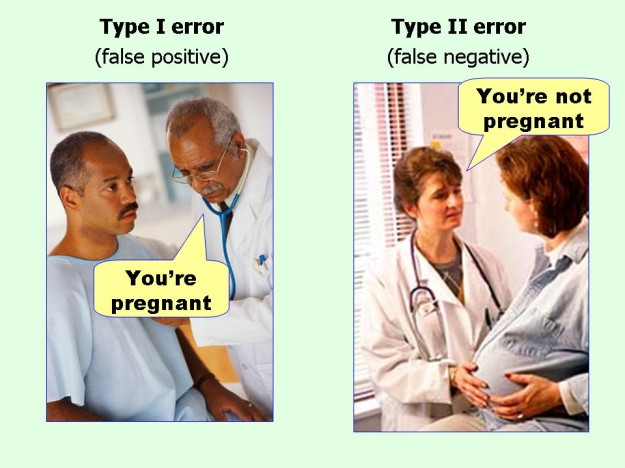

```{r setup, include=FALSE,}
knitr::opts_chunk$set(echo = FALSE,comment=NA,message=FALSE,warning = FALSE)
library(ggplot2)
library('gridExtra')
library(dplyr)
DisplayVect <- function(v,NbItemPerLine=6,Max=30,Round=3){
  lv <- length(v)
  Max <- min(lv, Max)
  v <- v[1:Max]
  for (ii in 1:(lv%/%NbItemPerLine)){
    cat(round(v[((ii-1)*NbItemPerLine+1):(ii*NbItemPerLine)],Round),'\n')
  }
  if (lv%%NbItemPerLine !=0){
    cat(round(v[(lv- lv%%NbItemPerLine + 1):lv],Round),'\n')
  }
}
```

```{r xaringan-scribble, echo=FALSE}
xaringanExtra::use_scribble()
```

---

## Main Idea

Some research directions can be formulated as .blue[questions] with a yes / no answer: 

- Is the expression of gene HER2 large in breast cancer ?
- Is a new variety of tomato more resistant to mildew than the previous one ?
- Is food cheaper in China than in France ?

--

You collect .alert[noisy data] about the problem and want to give an *evidence based* .blue[answer] to the question

--

```{r, echo = FALSE, out.width="300px", fig.align='center'}

```

---

## When should you use a test ?

* You have a .alert[yes/no] question

* You have .alert[data] related to the question

* The data can be .alert[modeled] as the result of some .alert[random variable]

* The question can be framed in terms of .alert[parameters] of the distribution

--

.pull-left[
You can either:
- **reject** the null hypothesis: observed patterns are unexpected under your assumptions
- **retain** the null hypothesis: observed patterns are expected under your assumptions
  - .red[**Does not imply that your assumptions are true**]
]

--

.pull-right[
```{r, echo = FALSE, out.width="300px", fig.align='center'}

```
]

---
## Four elements of a test


.pull-left-70[
- **Data:** 
    * $y_1, ..., y_n$ realisation of r.v. $Y_1, ..., Y_n$
- A statistical **model**: 

    * distribution of  $Y_1,..., Y_n$ depending on some parameters $\theta$

- An **assumption**: 

    * A statement about $\theta$. 
    * This is the so called $H_0$ hypothesis that you usually want to reject, $H_1$ being the alternative

- A **decision rule** 

  	* If $T=f(X_1,..., X_n)$ is a test statistic
  	* $R$  is subset of values for $T$ that is unlikely if $H_0$ is true
]

---
## An example with babies

- **Data**: biological sex of children born in 2020 in France (from [INED and INSEE](https://www.ined.fr/fr/tout-savoir-population/chiffres/france/naissance-fecondite/naissances-sexe/))
  - 356 389 `r emo::ji("boy")` / 340 275 `r emo::ji("girl")`

- **Model**: 
  - The sex of a newborn is $\sim \mathcal{B}(p)$, a Bernoulli of parameter $p$ (where 1 stands for girls and 0 for boys)
  - Sex of all children are i.i.d. (.alert[modeling assumption])
  
- **Null Hypothesis**
  - There is an equal chance of being born a boy or a girl $\Rightarrow p = 1/2$
  
- **Decision rule**
  - Test statistic: .alert[frequency] $\hat{p}$ of girls among children born in 2020
  - Reject $H_0$ if $\hat{p}$ is **too far** from $1/2$ 
  
--

.center[.alert[The hard work consists in quantifying what is *too far*]]

---
## Decision errors

The decision is based on .alert[noisy data] and so is .alert[error-prone]

```{r, echo = FALSE, out.width = "700px", fig.align='center'}

```

.footnote[Image from [whatilearned](https://whatilearned.fandom.com/wiki/Hypothesis_Testing)]

---
### Type I/ Type II error for pregnancy tests

```{r, echo = FALSE, out.width="700px", fig.align='center'}

```

---

### A few remarks

- Strong .alert[asymetry] between $H_0$ and $H_1$

- You want to accumulate sufficient evidence .alert[against] $H_0$. 

- Analogy with trials: $H_0$ is on trial, do you have enough proof to convict it? 

.center[
**Necessary trade-off** between type I and type II errors:
]
--

.pull-left-70[
- .alert[more stringent] criteria : 
  - less wrongful convictions (type I errors) 
  - more criminals released (type II errors, lack of power)
<br>
<br>
<br>
]

.pull-right-30[
```{r echo = FALSE, out.width="150px"}

```
]

--

.pull-left-70[
- .alert[less stringent] criteria: 
  - less criminals released (type II errors)
  - more wrongful convictions (type I error) 
]

.pull-right-30[
```{r echo = FALSE, out.width="150px"}

```
]

---

## Construction of a test

.pull-left-70[
- Start with an .alert[estimator] for the parameter of intercept:
    - Frequencies $F$ of girls among newborn
]

--

.pull-left-70[    
- Derive the .alert[distribution] of $F$ under $H_0$
    - For $n = 356 389 + 340 275$, using the gaussian approximation, we have 
    $$F \sim \mathcal{N}(1/2, 1/4n) = \mathcal{N}(0.5, 3.6 \times 10^{-7})$$
]

.pull-right-30[
```{r echo = FALSE, fig.width = 5, fig.height=5, out.width="700px"}
n <- 356389+340275
x <- seq(0.495, 0.505, length.out = 101)
density <- dnorm(x, mean = 0.5, sd = sqrt(1/(4*n)))
plot(x = x, y = density, type = "l")
abline(v = c(0.4988142, 0.5011858), col = "blue", lty = 2)
```
]

--

.pull-left-70[
- Calibrate the .alert[region of unlikely values] under the null
    - With probability 0.95, $|F - 1/2| \leq 1.96 \times \sqrt{3.6\times 10^{-7}} = 0.0012$
    - $F \notin [0.4988, 0.5012]$ with probability at most 5%
]

--

.pull-left-70[
- Compare with the .alert[actual estimation]
    - Here $f = 340 275 / (356 389 + 340 275) = 0.488$
    - Unlikely if $p= 1/2$ $\Rightarrow$ reject $H_0$
    
]

---

## About the p-value

**Idea** Go one step further than **reject / retain** and assess the .alert[significance] of the observed statistic

.pull-left-50[
- $|F - 1/2|$ .alert[unlikely] to be higher than $0.0012$

- $|f - 1/2|$ .alert[actually] observed to be $0.012$
]

--

.pull-right-50[
```{r, echo = FALSE, fig.width=5, fig.height=3.9, out.width="700px"}
n <- 356389+340275
x <- seq(0.485, 0.515, length.out = 1001)
sdev <- sqrt(1/(4*n))
density <- dnorm(x, mean = 0.5, sd = sdev)
a <- qnorm(p = 0.025, mean = 0.5, sd = sdev) 
b <- qnorm(p = 0.975, mean = 0.5, sd = sdev) 
df <- tibble(x = x, 
             d = density, 
             side = case_when(
               x < a ~ "low", 
               x > b ~ "high",
               TRUE ~ "center"))
ggplot(df, aes(x = x, y = d)) + 
  geom_line() +
  geom_area(aes(y = d, fill = side)) + 
  scale_fill_manual(values = c(low = "darkred", center = "transparent", high = "darkred"), guide = "none") + 
  geom_vline(xintercept = c(a, b), color = "darkred", linetype = 2) +
  annotate(x = 0.5, y = dnorm(a, mean = 0.5, sd = sdev), hjust = 0.5, vjust = 0, geom = 'text', label = "alpha == 0.05", parse = TRUE, color = "darkred") +
  annotate(x = a, y = 250, hjust = 1.1, vjust = 0, geom = 'text', label = "f == 0.4988", parse = TRUE, color = "darkred") +
  annotate(x = b, y = 250, hjust = -0.1, vjust = 0, geom = 'text', label = "f == 0.5012", parse = TRUE, color = "darkred") +
  geom_vline(xintercept = c(0.488, 0.512), color = "red", linetype = 2) +
  annotate(x = 0.488, y = 0, hjust = -0.1, vjust = -0.5, geom = 'text', label = "f == 0.488", parse = TRUE, color = "red") +
  theme_bw() + 
  # annotate(x = t, y = 0.05, hjust = -1, vjust = 0, geom = 'text', label = "p", parse = TRUE, color = "red") + 
  NULL
```
]

--

.pull-left-50[
- How likely are we to observe such deviations if $p=1/2$? 
]

--

.pull-left-50[
$$
\begin{align}
p &= P_{H_0}(|F - 1/2| > |f - 1/2|) \\
& = P_{H_0}(|F - 1/2| > 0.012) \\
& = P_{H_0}(F < 0.488) + P_{H_0}(F > 0.512) \\
& \simeq 5.5 \times 10^{-89}
\end{align}
$$
- Not only unlikely but .alert[insanely] unlikely !!!
]

---
## 谢谢山东大学威海校区 🌊⛱️☀️🥟🍜

```{r echo = FALSE, out.width="800px", fig.align='center'}

```


